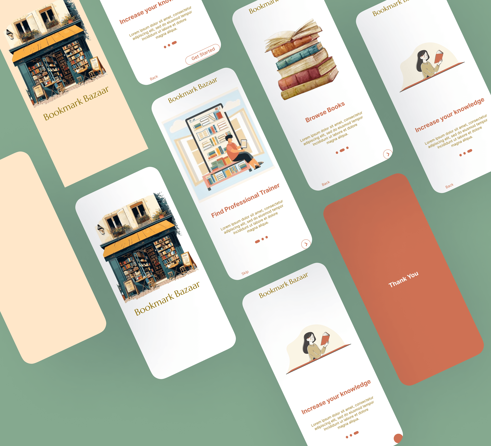

# 📚 Bookstore App

A beautifully animated **Flutter app** featuring sleek **Splash** and **Onboarding Screens** — designed for modern book lovers.


[](https://www.instagram.com/reel/DIycgLVz7rr/)

---

## ✨ Features

- 🖼️ Elegant splash screen with smooth animations  
- 📖 Multi-screen onboarding flow with clean transitions  
- 🧭 Intuitive navigation and user experience  
- 🛠️ Built entirely with **Flutter**

---

## 📹 Preview

> **✔️ Rate this animation from 1–10!**  
> 👇 Would you use an app like this for your next read?

🎥 **Watch Demo:** [Instagram Video](https://www.instagram.com/reel/DIycgLVz7rr/)  

---

## 💻 Getting Started

To run this project locally:

```bash
git clone https://github.com/codewithmashi/bookstore.git
cd bookstore
flutter pub get
flutter run
```

## 🚀 Tech Stack

- Flutter (Latest stable version)
- Dart
- GetX (for state management & routing) *(optional if used)*

## 🤝 Contribute

Pull requests are welcome! If you’d like to improve this UI or suggest features, feel free to open an issue.

---

## 📎 Links

- 🔗 **Source Code:** [GitHub Repo](https://github.com/codewithmashi/bookstore.git)
- 📲 **Follow for more UI ideas:** [@codewithmashi](https://instagram.com/codewithmashi)
